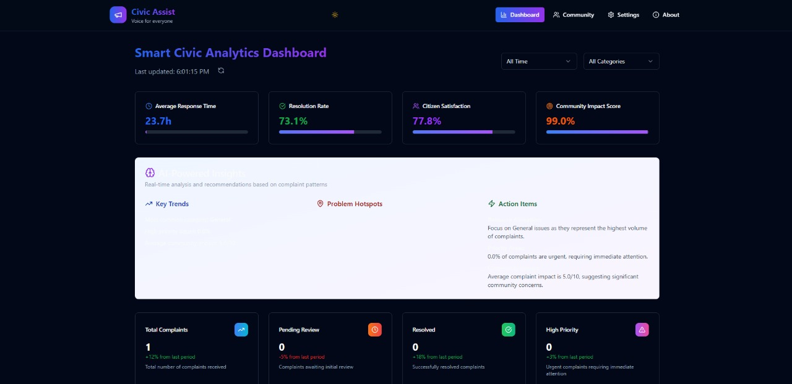
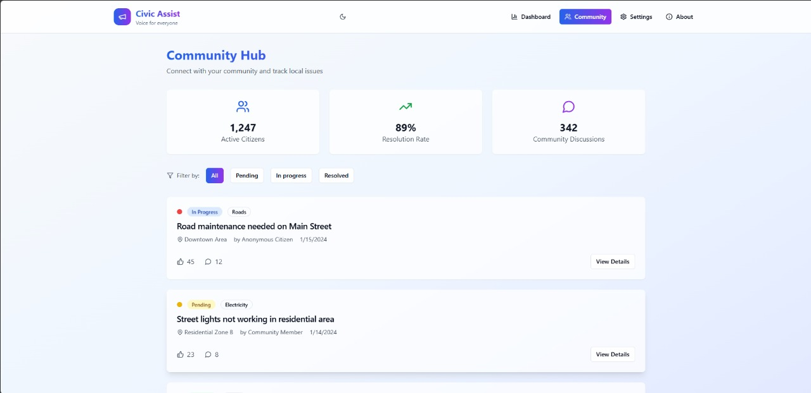
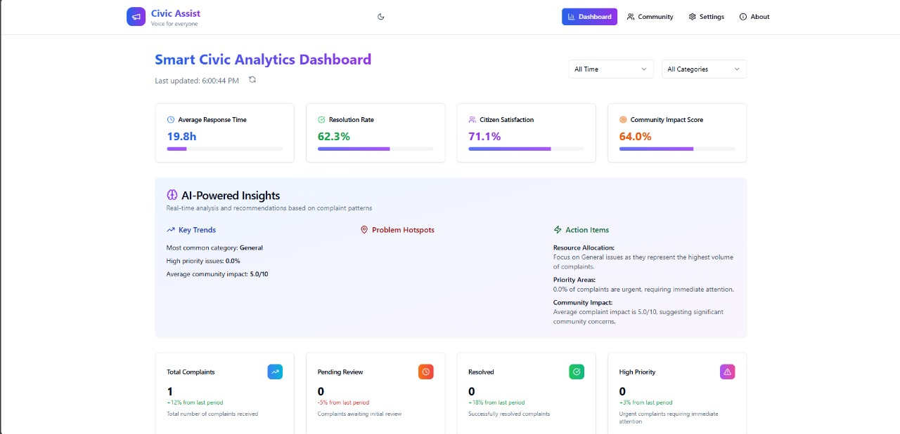

<h1 align="center">🎯 Voice-to-Complaint Web App</h1>
<h2 align="center"><em>Civic Assist for All</em></h2>

  <strong>Empowering every citizen to raise civic issues, using only their voice.</strong> 
  <em>Accessibility | Civic Tech | AI | Community Impact</em>

## 👁️‍🗨️ Project Vision

Imagine a world where **anyone**—the elderly, visually impaired, illiterate, or digitally unskilled—can submit civic complaints (garbage, water issues, broken streetlights, etc.) using just their voice.  
This project aims to break barriers and simplify how citizens engage with government services.

## 🚀 Features At a Glance

- 🎤 **Voice-to-Text Complaint Entry:** Speak your problem, see it transcribed instantly.
- 🌐 **Automatic Translation:** Converts complaints to local languages (e.g., Hindi).
- 🧠 **NLP Categorization:** Smartly detects and tags complaint type (garbage, water, etc.).
- 📝 **Summary & Preview:** Review before submitting.
- ☁️ **Cloud Storage:** Save complaints to Firebase or local device.
- 📱 **Fully Accessible UI:** Mobile-first, screen-reader-friendly, high-contrast design.
- 🗺️ **Interactive City Map:** See all reported problems as pins on a vibrant map.
- 🧑‍💻 **3D Interactive Assistant:** A 3D model listens, moves, and reacts while you speak.
- 📊 **Severity Visualizations:** Problem risks shown via interactive graphs.
- 🖼️ **Before/After Images:** Visual proof of issues and repairs.
- 📅 **Timelines & Stats:** Dates, counts, and trends for each complaint.
- 🏘️ **Community Dashboard:** Pending & resolved problems, all in your area.
- 👤 **User Profile & Settings:** Track your complaints, customize your experience.
- 🌗 **Dark Mode & Bright Theme:** Choose your vibe, day or night!

## 🛠️ Tech Stack

- **Frontend:** React.js, Tailwind CSS / CSS3, Web Speech API, Three.js (3D), Mapbox/Leaflet.js (maps)
- **AI/NLP:** OpenAI API (optional), Custom JS logic
- **Translation:** LibreTranslate API
- **Backend:** Firebase Firestore (or localStorage)
- **Other:** ARIA, Geolocation API, Chart.js/Recharts

## 🧪 Sample User Flow

1. **Start:** Open the site, click 🎤 “Start Speaking”.
2. **Speak:** “There’s garbage piling up near my house in Sector 7.”
3. **Live Transcription:** Text appears instantly, 3D assistant reacts.
4. **Translate:** One click to convert to Hindi:  
   _“मेरे घर के पास सेक्टर 7 में कूड़ा जमा हो रहा है।”_
5. **Auto-Categorization:** Detected as “Garbage Issue”, severity: "Risky".
6. **Map & Visuals:** Pin drops on the city map; see complaint stats & graphs.
7. **Images:** Upload before/after photos (if available).
8. **Submit:** Complaint saved, shown with all details in your dashboard.
9. **Community View:** See all problems, their status, and previous reports by others.
10. **Stay Updated:** Track resolution progress, view resolved issues & trends.

## 🎁 Bonus Interactivity

- 🗣️ **Text-to-Speech:** For visually impaired users.
- 🌍 **Auto Language Detect:** Speak in any language, app detects and translates.
- 🗃️ **Download/Share:** Export complaint as PDF, email, or share.
- 📍 **Live GPS Tagging:** Automatic location on the map.
- ⚡ **Real-Time Stats:** Dynamic graphs (problem counts, severity, time-to-resolve).
- 🏅 **Most Reported Issues:** See top issues in your area.
- 👥 **Previous Reporters:** Details & names of past users for same issues.

## 🏆 Why This Matters

> “No typing. No barriers. Just your voice — and your complaint is logged.”

- **Democratizes access** to civic participation
- **Boosts transparency** in problem reporting and resolution
- **Empowers communities** with real data and visual feedback
- **Bridges the digital divide** for all citizens

## 🖼️ Screenshots & Demos

## 💡 Want to know more?

Check out the repo for code, setup instructions, and feature roadmap.  
Questions or feedback? [Open an issue](https://github.com/2wizArd9)!

  <strong>“Civic Access for All”</strong> 
  <em>Innovation | Inclusion | Impact</em>

